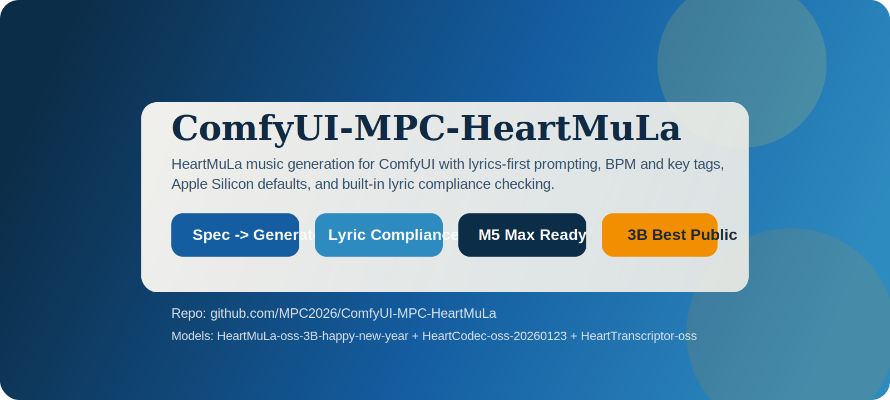
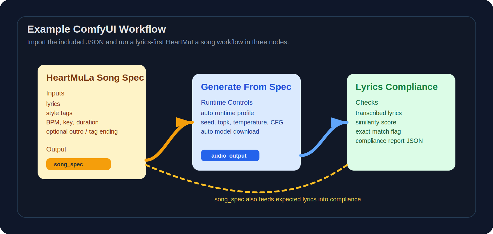
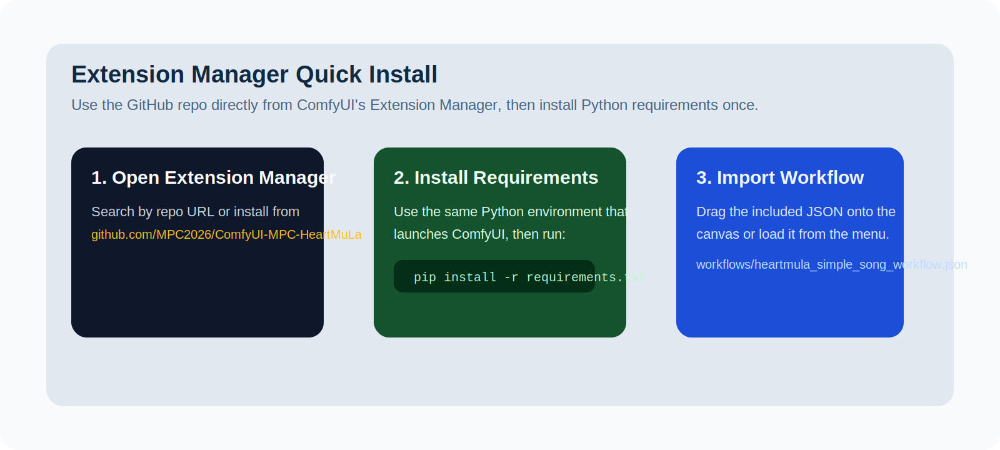

# ComfyUI-MPC-HeartMuLa



ComfyUI custom nodes for HeartMuLa music generation with a workflow surface built around the controls you asked for: tags, BPM, song key, duration, lyrics, optional outro or tag ending, and lyric compliance checking after generation.



## What this package does

- Uses the official `heartlib` pipeline API at runtime. This repo does not try to replace HeartMuLa's runtime with a separate custom inference stack.
- Ships a pinned local copy of `heartlib` inside this repository, so runtime startup does not need to fetch `heartlib` from the network.
- Prefers local HeartMuLa model folders in `ComfyUI/models/HeartMuLa`, matching the manual setup style used by other HeartMuLa ComfyUI integrations.
- Keeps the on-disk layout in official HeartMuLa names such as `HeartMuLa-oss-3B`, `HeartCodec-oss`, `HeartMuLa-RL-oss-3B-20260123`, `gen_config.json`, and `tokenizer.json`.
- Auto-detects the best compatible generation pair it finds:
  - `HeartMuLa-RL-oss-3B-20260123` + `HeartCodec-oss-20260123`
  - `HeartMuLa-oss-3B-happy-new-year` + `HeartCodec-oss-20260123`
  - `HeartMuLa-oss-3B` + `HeartCodec-oss`
- Targets Apple Silicon well by default.
  - `auto` uses the recommended `heartlib` split-device path: HeartMuLa on MPS, HeartCodec on CPU.
  - If that fails, it falls back to CPU-only.
  - `apple_silicon_fast` is still available as a manual all-MPS override, but it is no longer the default path.
- Saves lossless `.wav` output in the ComfyUI output folder.
- Leaves `auto_download_models` available as a fallback, but defaults it off so the node pack uses your manually downloaded HeartMuLa folders first.

## Format choice

This repo follows `heartlib` for runtime behavior and pipeline semantics.

It follows official HeartMuLa naming for the checkpoint folders on disk.

That means:

- runtime API: `heartlib`
- `heartlib` source: vendored locally in `_vendor/heartlib-main/src/heartlib`
- pinned upstream revision: `3783bdb8441f2c298b1e64c8651173aac200361c`
- model root: `ComfyUI/models/HeartMuLa`
- folder names: official HeartMuLa folder names inside that root
- Apple Silicon default: MPS for the HeartMuLa model, CPU for HeartCodec, then CPU-only fallback

## Self-contained runtime

This repo now includes a vendored copy of `heartlib` under `_vendor/heartlib-main/src/heartlib`.

That vendored copy is pinned to upstream `HeartMuLa/heartlib` commit `3783bdb8441f2c298b1e64c8651173aac200361c`.

The runtime no longer downloads `heartlib` on first use. If the vendored copy is missing, startup fails with an explicit local-repo error instead of silently fetching code from the internet.

## Truly offline install

Extension Manager is not the offline path because it still needs network access to fetch the repository.

For a no-network install on the target machine, use the local bundle workflow included in this repo:

1. On a connected machine, populate `_offline/wheels/` with Python wheels by running `./scripts/build_offline_bundle.sh --python /path/to/comfyui/python`.
2. If you already have a working local HeartMuLa model root, add `--model-root /path/to/ComfyUI/models/HeartMuLa` so the same command copies it into `_offline/models/HeartMuLa/`.
3. Move the whole repo folder to the offline machine by USB, AirDrop, LAN copy, or any other local transfer.
4. Put the repo in `ComfyUI/custom_nodes/ComfyUI-MPC-HeartMuLa` on the offline machine.
5. Run `./scripts/install_offline.sh --python /path/to/comfyui/python --comfyui-root /path/to/ComfyUI`.
6. Keep `auto_download_models` off. The offline installer writes `_offline/STRICT_OFFLINE`, and runtime will reject network fallback paths on purpose.

The offline bundle layout is documented in `_offline/README.md`.

## Quick Start

1. Install from the ComfyUI Extension Manager, clone into `custom_nodes`, or move in a prepared offline bundle.
2. Install Python requirements with the same Python that launches ComfyUI, or run `./scripts/install_offline.sh` if you prepared `_offline/wheels/`.
3. Put the HeartMuLa model folders in `ComfyUI/models/HeartMuLa`, or let `./scripts/install_offline.sh` copy a prepared `_offline/models/HeartMuLa/` bundle.
4. Import `workflows/heartmula_simple_song_workflow.json`.
5. Edit the lyrics, tags, BPM, song key, and duration inside `HeartMuLa Song Spec`.
6. Run the workflow.
7. Review the generated `.wav` and the lyric compliance report.

## Important note on model size

HeartMuLa mentions an internal 7B model, but the open-source 7B checkpoint is not released yet. The largest public option today is the 3B line. This node pack supports the released 3B folders listed above and prefers the RL 20260123 pair when it is present locally.

## Installation

### Extension Manager



Once this repository is pushed to GitHub, install it from the ComfyUI Extension Manager by repository URL:

`https://github.com/MPC2026/ComfyUI-MPC-HeartMuLa.git`

The node pack already has the standard custom-node entrypoints and a `requirements.txt` for dependency installation.

Extension Manager path:

1. Open ComfyUI.
2. Open `Manager`.
3. Open `Custom Nodes` or `Install via Git URL`, depending on your manager version.
4. Paste `https://github.com/MPC2026/ComfyUI-MPC-HeartMuLa.git`.
5. Install the node.
6. Restart ComfyUI.
7. Install Python requirements if your manager did not do it automatically.

### Simple custom node install

1. Close ComfyUI.
2. Open a terminal and go to your ComfyUI folder.
3. Go into `custom_nodes`.
4. Clone this repo so the final folder is `ComfyUI/custom_nodes/ComfyUI-MPC-HeartMuLa`.
5. Activate the exact Python environment you use to start ComfyUI.
6. From this node folder, run `pip install -r requirements.txt`.
7. Start ComfyUI again.
8. Search for `HeartMuLa` in the node picker.

Example:

```bash
cd /path/to/ComfyUI/custom_nodes
git clone https://github.com/MPC2026/ComfyUI-MPC-HeartMuLa.git
cd ComfyUI-MPC-HeartMuLa
pip install -r requirements.txt
```

If your ComfyUI launcher uses a bundled Python, use that Python for the install command instead of system `pip`.

### Offline custom node install

1. On a connected machine, run `./scripts/build_offline_bundle.sh --python /path/to/comfyui/python --model-root /path/to/ComfyUI/models/HeartMuLa`.
2. Move this whole repo folder to the offline machine.
3. Put it in `ComfyUI/custom_nodes/ComfyUI-MPC-HeartMuLa`.
4. Run `./scripts/install_offline.sh --python /path/to/comfyui/python --comfyui-root /path/to/ComfyUI`.
5. Restart ComfyUI and keep `auto_download_models` disabled.

If your ComfyUI Python does not already include `torch`, rebuild the offline bundle with `--include-torch`. The bundle script will also try to capture the matching `torchaudio` wheel from that same Python environment.

### Import the included workflow

1. Start ComfyUI after installing the node.
2. Drag `workflows/heartmula_simple_song_workflow.json` onto the canvas.
3. Or use the workflow load/import menu and select that file.
4. Use the updated workflow file if you imported an older version before. The current JSON avoids custom spec links so labels import cleanly on more ComfyUI frontends.

### First run

1. Follow the manual model setup below.
2. Import the included workflow or add the three standard nodes manually.
3. Leave `auto_download_models` off unless you explicitly want the fallback downloader.
4. Leave `runtime_profile` on `auto` for Apple Silicon.
5. Run the workflow once.
6. Find the generated `.wav` in your ComfyUI output folder.
7. Read the lyric compliance score and report on the final node.

## Manual HeartMuLa model setup

Go to your `ComfyUI/models` folder first, then download the HeartMuLa assets with the Hugging Face CLI.

These commands intentionally keep the official HeartMuLa folder names because the node pack resolves them through the `heartlib` runtime from a shared `ComfyUI/models/HeartMuLa` root.

```bash
cd /path/to/ComfyUI/models

# 1. HeartMuLaGen
hf download HeartMuLa/HeartMuLaGen --local-dir ./HeartMuLa

# 2. HeartMuLa base model
hf download HeartMuLa/HeartMuLa-oss-3B --local-dir ./HeartMuLa/HeartMuLa-oss-3B

# or RL 20260123 model
hf download HeartMuLa/HeartMuLa-RL-oss-3B-20260123 --local-dir ./HeartMuLa/HeartMuLa-RL-oss-3B-20260123

# 3. HeartCodec
hf download HeartMuLa/HeartCodec-oss --local-dir ./HeartMuLa/HeartCodec-oss

# or the 20260123 codec for the newer RL / 20260123 model family
hf download HeartMuLa/HeartCodec-oss-20260123 --local-dir ./HeartMuLa/HeartCodec-oss-20260123

# 4. HeartTranscriptor
hf download HeartMuLa/HeartTranscriptor-oss --local-dir ./HeartMuLa/HeartTranscriptor-oss
```

Compatibility note:

- If you download `HeartMuLa-RL-oss-3B-20260123`, you must use `HeartCodec-oss-20260123`.
- If you already have `HeartMuLa-oss-3B-happy-new-year`, this node pack will also use it automatically when `HeartCodec-oss-20260123` is present.

The included workflow defaults to manual model usage. Turn on `auto_download_models` only if you want the node to fetch the base public pair for you.

For strict offline installs, leave `auto_download_models` off. The offline installer creates `_offline/STRICT_OFFLINE`, and runtime will fail fast instead of attempting network downloads.

## Nodes

### `HeartMuLa Song Spec`

Builds generation-ready lyrics and comma-separated tags from:

- raw lyrics
- style tags
- BPM
- song key
- duration
- optional outro or tag ending

Outputs:

- formatted lyrics
- effective tags
- `max_audio_length_ms`
- metadata JSON
- `song_spec` as an optional convenience output

### `HeartMuLa Generate From Spec`

Uses the `song_spec` output from `HeartMuLa Song Spec` if you want a custom-type convenience path instead of standard primitive links.

Returns:

- `AUDIO`
- saved file path
- metadata JSON

### `HeartMuLa Generate Music`

Runs HeartMuLa generation and returns:

- `AUDIO`
- saved file path
- metadata JSON

The included workflow uses this node with standard `STRING` and `INT` links from `HeartMuLa Song Spec`.

### `HeartMuLa Lyrics Compliance`

Transcribes generated audio with HeartTranscriptor and compares it against your intended lyrics.

Returns:

- transcribed lyrics
- similarity score
- exact match boolean
- report JSON

The included workflow links `expected_lyrics` from `HeartMuLa Song Spec` so the compliance check follows the exact same lyric text used for generation.

### `HeartMuLa Lyrics Compliance From Spec`

Consumes `song_spec` directly as an optional convenience path.

## Recommended simple workflow

`HeartMuLa Song Spec` -> `HeartMuLa Generate Music` -> `HeartMuLa Lyrics Compliance`

Use the included workflow JSON if you want the fastest start. It uses only standard `STRING`, `INT`, and `AUDIO` links so the widget labels import cleanly.

Included example workflow:

- `workflows/heartmula_simple_song_workflow.json`

## Apple Silicon defaults

For a 2026 MacBook Pro M5 Max with 128 GB RAM, the defaults are tuned toward quality first without forcing a fragile setup:

- `runtime_profile = auto`
- `auto` means HeartMuLa on `mps` and HeartCodec on `cpu`
- CPU-only is the fallback path if MPS is unavailable or fails
- `keep_model_loaded = true`
- `cfg_scale = 1.8`
- `.wav` output

If you want to experiment with an all-MPS path anyway, `apple_silicon_fast` is still exposed as a manual override rather than the default.

## Lyric adherence and prompt behavior

HeartMuLa currently accepts only `lyrics` and comma-separated `tags` as conditioning inputs. This package maps BPM and song key into tags and appends an optional `[Outro]` block when requested.

Two limits come from upstream HeartMuLa itself:

- text is lowercased internally by the official pipeline
- exact lyric reproduction is improved but still model-limited rather than guaranteed

This node pack biases toward lyric clarity by adding `clear vocals` and `lyric forward` tags to the generated prompt.

The lyric compliance node helps you measure that gap after generation instead of guessing.